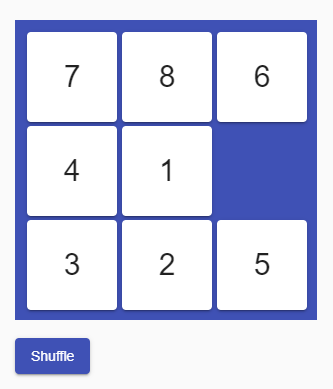

# num-puzzle

num-puzzle is a simple number puzzle game built using Angular Material and CSS Grid.  
It uses the `cdk-drag` component in Angular Material CDK and CSS Grid for aligning the tiles in the layout.

  

See it in action here: https://num-puzzle.stackblitz.io

[Imported from StackBlitz ⚡️](https://stackblitz.com/@Ndibui)
